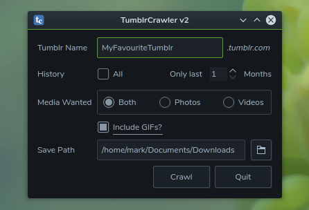

# TumblrCrawler
Download images and videos from  Tumblr sites quickly and easily. Will also grab embedded video from YouTube, Vimeo, Instagram and various other external sites. Requires PyQt5, Python BeautifulSoup, aria2c and youtube-dl.  
  
TumblrCrawler is a front-end GUI for tumblrcrawl_2.py.  

## Installation
Running  

```
sudo ./install.sh
```
will install TumblrCrawler and tumblrcrawl_2.py to /usr/bin and add a menu entry in /usr/share/applications.  

## Usage
The GUI is self-explanatory. Help is provided in tooltips. You can also run tumblrcrawl.py in a terminal:
```
tumblrcrawl.py tumblrname [months] [p] [v] [g]
```

tumblrname (required) is the site you want to crawl. Optional arguments are:
* months (number) - only grab the most recent number of months
* p - only grab photos
* v - only grab videos
* g - include gifs
