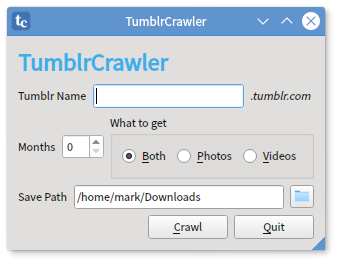

# TumblrCrawler
Download images and videos from  Tumblr sites quickly and easily. Will also grab embedded video from YouTube, Vimeo and Instagram. Requires PyQt5, aria2c and youtube-dl.  

## Installation
```
sudo ./install.sh
```

## Usage
The GUI is self-explanatory; read the tooltips. You can also run the CLI version in a terminal:
```
tumblrcrawl.py tumblrname [months] [p] [v]
```

tumblrname (required) is the site you want to crawl. Optional arguments are:
1. months (number) - only grab the most recent number of months
2. p - only grab photos
3. v - only grab videos

Files will be written into a sub-directory from the current working directory.
