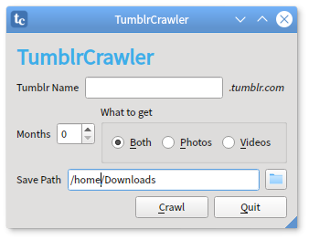

# TumblrCrawler
Download images and videos from  Tumblr sites quickly and easily. Will also grab embedded video from YouTube, Vimeo and Instagram. Requires PyQt5, aria2c and youtube-dl.  
  
TumblrCrawler is a front-end GUI for tumblrcrawl.py.  

## Installation
Running  

```
sudo ./install.sh
```
will install TumblrCrawler and tumblrcrawl.py to /usr/bin and add a menu entry in /usr/share/applications.  

## Usage
The GUI is self-explanatory. Help is provided in tooltips. You can also run tumblrcrawl.py in a terminal:
```
tumblrcrawl.py tumblrname [months] [p] [v]
```

tumblrname (required) is the site you want to crawl. Optional arguments are:
* months (number) - only grab the most recent number of months
* p - only grab photos
* v - only grab videos
